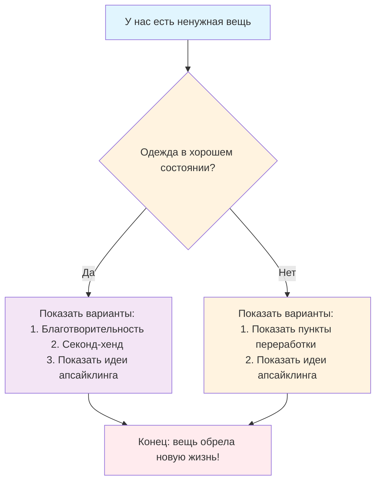

У меня есть ненужная для меня одежда, да и в принципе одежда - это расходник, следовательно она в какой-то момент перестает быть юзабельной (становиться некрасивой или просто изнашивается, становиться маленькой, а если вы следите за писками моды, то возможно она просто стала не актуальна) и куда же ее можно деть? Выбросить? Нет, так как сейчас мы видим, что в мире проблема с тем, что появляются свалки (просто горы мусора).
Так что же мы можем сделать с ненужной одеждой? И так вот алгоритм: 

